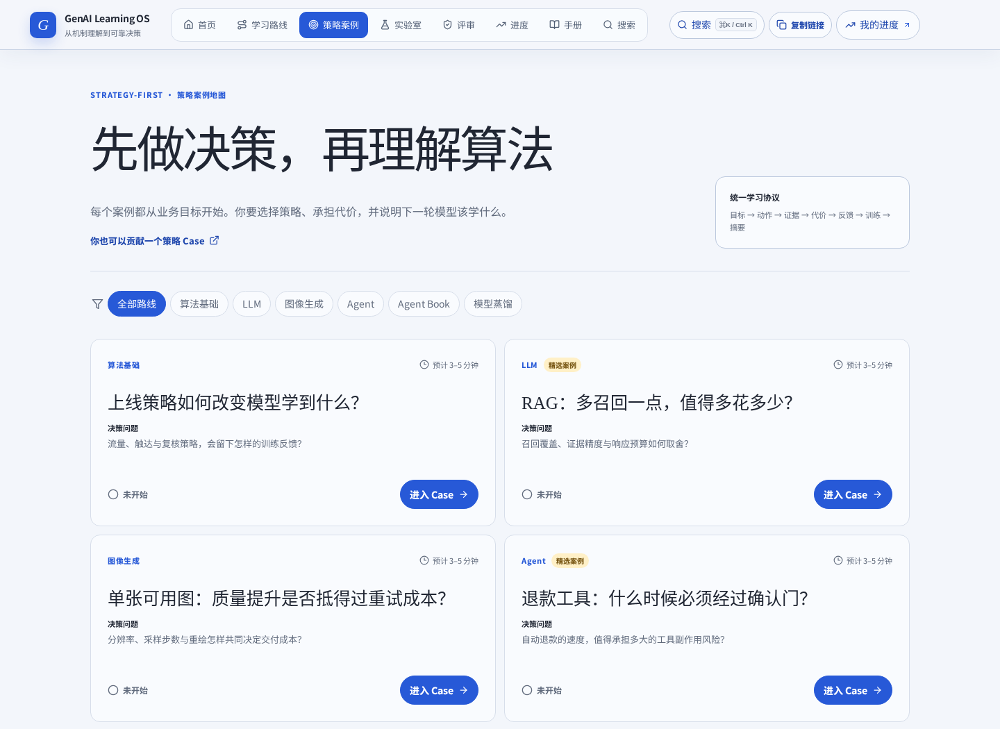

# GenAI Learning OS

**Learn AI through product decisions, not formulas first.**

[Try it online](https://haimuhaimu.github.io/genai-learning-os/) · [Start with Strategy Cases](https://haimuhaimu.github.io/genai-learning-os/?page=strategy-cases) · [Join the learner co-build hub](https://haimuhaimu.github.io/genai-learning-os/?page=co-build) · [Read the contribution guide](CONTRIBUTING.md) · [中文 README](README.md)

**9 learning tracks · 9 representative Strategy Cases + 8 AI decision-math exercises · 43 curated videos/courses + 21 explained core papers**, with Chinese courses, Karpathy resources, and reading paths spanning recommender systems, LLMs, agents, and world models.

Most tutorials explain how models run. This project asks you to make a product strategy decision first, then return to the mechanism to understand metrics, costs, and feedback loops.

## Learning feedback center

A Feedback entry is available in both the desktop header and mobile menu. The center collects learning gain, difficulty/depth, workplace transfer, the biggest blocker, and suggestions, then creates a prefilled GitHub Issue or copies Markdown. Route context is off by default; when explicitly enabled, it is limited to the `page/module/experiment/node/section/chapter/card/case/paper` allowlist defined by `routeConfig`. It never reads or sends local progress, strategy summaries, resource-loop responses, browser UA, or other `localStorage` data. Reaching the reviewed stage or saving a strategy summary shows one low-distraction nudge instead of opening the modal automatically.

## Learner co-build hub

[`?page=co-build`](https://haimuhaimu.github.io/genai-learning-os/?page=co-build) offers three contribution paths: one-minute feedback, a 30-minute content contribution, or a deeper Strategy Case. Each path links directly to in-site feedback, Issue Forms, the `good first issue` search, or authoring guidance. First-time contributors can follow four steps: choose a scoped problem, align with the guide, make and validate the smallest change, then open a reviewable PR. Contributors may provide a public display name and optional homepage in the PR template. The Roadmap does not promise dates, and public Issues or PRs must not include real account data, private logs, credentials, internal domains, or undisclosed vulnerabilities.



## Three flagship cases

### RAG budget trade-off · `rag-budget`

**Decision:** Is broader retrieval worth more noise, context cost, and latency? The output is a reviewable RAG launch summary with `k`, rerank threshold, answer mode, metrics, and the next data action. [Open the case](https://haimuhaimu.github.io/genai-learning-os/?page=strategy-case&case=rag-budget)

### Refund tool confirmation gate · `refund-gate`

**Decision:** Is faster automatic refunding worth the risk of tool side effects? The output is a governance strategy covering the gate, risk threshold, business cost, trace requirements, and next data action. [Open the case](https://haimuhaimu.github.io/genai-learning-os/?page=strategy-case&case=refund-gate)

### Multi-agent new-information criterion · `new-information`

**Decision:** Does another role add a new observation or repeat the same judgment? The output is a collaboration strategy with topology, verifier, success and duplication metrics, unit cost, and Harness improvements. [Open the case](https://haimuhaimu.github.io/genai-learning-os/?page=strategy-case&case=new-information)

## How it differs from a typical algorithm course

| Dimension | Typical algorithm course | GenAI Learning OS |
| --- | --- | --- |
| Learning order | Formula first, application later | Product decision first, mechanism second |
| Progress | Chapter completion | Reviewable, saved strategy evidence |
| Knowledge structure | Stacked topics | Fixed evidence, a cost ledger, and a feedback loop |

## One learning protocol

Every Strategy Case follows the same seven-part chain:

1. **Business objective** — define what should improve.
2. **Strategy action** — expose real controllable variables.
3. **Fixed evidence** — use reproducible teaching data.
4. **Cost ledger** — show quality, cost, latency, or risk together.
5. **Feedback visibility** — state what the strategy reveals and hides.
6. **Next training loop** — turn failure slices into data or system actions.
7. **Strategy summary** — produce a conclusion that can be reviewed and iterated.

## Resource learning loop and paper mechanism labs

Every unified Strategy Case now supports an **initial judgment → user-opened resource → review judgment → side-by-side comparison** loop. A resource is marked as “touched” only after the learner actively opens it; this never means watched, read, or mastered. Responses and touch timestamps are isolated by case in the current browser under `genai-resource-loop-v1`. Learners can clear only the current case, and unavailable `localStorage` safely falls back to session state without advancing existing progress.

The [paper mechanism labs](https://haimuhaimu.github.io/genai-learning-os/?page=paper-lab) provide five deterministic, backend-free experiments for Transformer, Wide & Deep, DDPM, ReAct, and DreamerV3. The Transformer experiment is now a five-minute golden lesson, “Help AI Find the Real Refund Evidence.” It reveals one stage at a time—guess first, watch AI fail, change one condition, summarize the rule, then reveal the mechanism—until learners can explain that Attention does not let a model see more; it selects the evidence that matters for the current question. Terminology and formulas appear only after the discovery. The other labs retain their business stories, controllable variables, dynamic explanations, and transfer templates. These mechanism-level teaching simplifications are not full training reproductions and do not represent production performance.

## Nine learning tracks

| Track | Decision focus | Representative case or lab |
| --- | --- | --- |
| Algorithm Foundations | How launch strategy changes training feedback | Feedback loop / Softmax & CE |
| AI Decision Math | Whether a number is strong enough to support an action | [Eight 3–5 minute exercises](https://haimuhaimu.github.io/genai-learning-os/?page=decision-math) |
| LLM Systems | Retrieval quality, latency, and budget | RAG budget trade-off |
| Image Generation | Usability, retries, and unit cost | Usable-image unit cost |
| Agent Systems | Tool side effects and confirmation | Refund confirmation gate |
| Agent Book | Whether topology adds information | New-information criterion |
| Model Distillation | Agreement versus capability retention | Distillation retention |
| Self-Evolving AI (frontier) | Evaluator trust and stop conditions | [Evaluator Trust](https://haimuhaimu.github.io/genai-learning-os/?page=strategy-case&case=evaluator-trust) |
| World Models (frontier) | Simulation, LLM rollouts, and real feedback | [Simulator vs Reality](https://haimuhaimu.github.io/genai-learning-os/?page=strategy-case&case=simulator-vs-reality) |

> Self-evolving AI and world models are still early. They are presented as bounded exploration tracks, not mature production recipes.

## Who it is for

AI product managers, strategy and operations practitioners, engineers and researchers, and people moving into AI work who want a practical language for decisions rather than a formula-first syllabus.

## Curated resources

The [video and course library](https://haimuhaimu.github.io/genai-learning-os/?page=videos) now contains 43 curated entries, including 3Blue1Brown, StatQuest, D2L, Hung-yi Lee, OpenBMB, Hugging Face, MIT, Stanford, CMU, DeepLearning.AI, and Google resources. Filter them by route, language, level, and origin.

The new [paper explainer library](https://haimuhaimu.github.io/genai-learning-os/?page=papers) contains 21 core papers across recommender systems, Transformer / LLM, diffusion / multimodal, Agent / Harness, and self-improvement / world models. Every card presents a 30-second explanation, core mechanism, product lens, and a question to take back to the course. See the [video contribution guide](docs/VIDEO_CONTRIBUTING.md) and [paper explainer contribution guide](docs/PAPER_CONTRIBUTING.md).

## Contribute a Strategy Case

1. Copy the typed, unregistered example in [`examples/strategy-case`](examples/strategy-case/).
2. Implement the spec, pure `compute()` / `summarize()` functions, tests, and one catalog entry.
3. Follow the [Strategy Case authoring guide](docs/CASE_AUTHORING.md) and [CONTRIBUTING.md](CONTRIBUTING.md) before opening a Pull Request.

## Local development

Requires Node.js 20+ and pnpm 10+.

```bash
git clone https://github.com/haimuhaimu/genai-learning-os.git
cd genai-learning-os
pnpm install
pnpm dev
```

The app is frontend-only: no sign-in, backend, model API calls, or account collection. Progress stays in the current browser's `localStorage`. Feedback leaves the page only when the user opens a GitHub Issue or copies Markdown, and route context is excluded by default. GitHub Pages deployment is defined in [the Pages workflow](.github/workflows/deploy-pages.yml), with the repository homepage and canonical URL pointing to the production Pages site.

## Validation

```bash
pnpm run lint
pnpm run build
pnpm run check:videos
pnpm run typecheck:case-example
node --test
git diff --check
```

All formulas, estimates, charts, and outputs are mechanism-level teaching simulations. They do not represent a commercial model implementation or measured production performance. Validate production decisions with the target model, real data, logs, load tests, and security review.

## Project structure

```text
.
├── docs/CASE_AUTHORING.md          # Strategy Case authoring protocol
├── docs/VIDEO_CONTRIBUTING.md      # Curated video contribution guide
├── docs/PAPER_CONTRIBUTING.md      # Paper explainer contribution guide
├── examples/strategy-case/         # Typed example, intentionally not registered
├── src/components/hubs/CoBuildHub.tsx # Learner co-build hub
├── src/resources/videoCatalog.ts   # Structured video/course catalog
├── src/resources/paperCatalog.ts   # Explained core-paper catalog
├── src/components/strategy/        # Case SDK, catalog, runner, and cases
├── src/components/foundation/      # Foundations and the unified map
├── src/searchIndex.ts              # In-site search index
└── .github/ISSUE_TEMPLATE/         # Bug, content, Case, and maintenance forms
```

## Roadmap

[ROADMAP.md](ROADMAP.md) lists direction without date commitments.

## License

Licensed under [Apache License 2.0](LICENSE). See [THIRD_PARTY_NOTICES.md](THIRD_PARTY_NOTICES.md) for attribution and third-party terms.

## Acknowledgements

The Agent Book module references and adapts [bojieli/ai-agent-book](https://github.com/bojieli/ai-agent-book) by Bojie Li; see [THIRD_PARTY_NOTICES.md](THIRD_PARTY_NOTICES.md). The visual revision methodology was informed by [taste-skill](https://github.com/haimuhaimu/taste-skill); no code or text from that project is copied here.

[中文 README](README.md) · [Contributing](CONTRIBUTING.md) · [Code of Conduct](CODE_OF_CONDUCT.md) · [Security](SECURITY.md)
